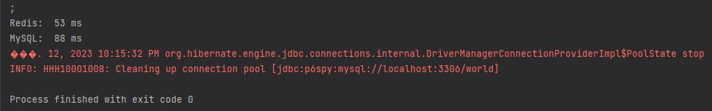

#hibernate-final-project
##Задача проекта
Создать и оптимизировать консольное приложение, которое с помощью `Redis` будет вытягивать только выбранный набор полей.
Показать разницу время отдачи данных из `MySQL` и `Redis`.
###Краткое описание
Есть реляционная БД `MySQL` с схемой (страна-город, язык по стране). И есть частый запрос города, который тормозит.
Есть решение – вынести все данные, которые запрашиваются часто, в `Redis` (in memory storage типа ключ-значение).
И нужны нам, не все данные, которые хранятся в `MySQL`, а только выбранный набор полей.
###Краткое описание классов
В корневом пакете проекта `com.javarush` находятся 3 пакета `domain`, `dao` и `redis`, а
точка входа в приложение - класс **Main**.
* пакет `domain` содержит ентити-классы **City**, **Continent** и **Country** для мапинга соответствующих таблиц БД
* пакет `dao` содержит специальные классы **CityDAO** и **CountryDAO** для работы с соответствующими таблицами БД
* пакет `redis` содержит классы **CityCountry** и **Language**, которые содержат поля ентити-классов наиболее часто
запрашиваемых колонок таблиц БД
* класс **Main** содержит метод для записи данных (объектов) в `Redis`,
методы получения данных (объектов) из `MySQL` и `Redis` для сравнения скорости чтения
###Запуск приложения
Для запуска приложения необходимо:
* установить локально `Docker` и настроить его
* запустить `MySQL` сервер как докер-контейнер
* установить локально `Workbench` и создать новое соединение к БД, используя стандартный порт `3306`
* развернуть дамп в `Workbench`
* добавить подключение БД в среде разработки `IntelliJ IDEA Ultimate`
* запустить `Redis` сервер как докер-контейнер
* установить `redis-insight`
###Результаты выполнения программы
После запуска класса **Main** получаем следующий вывод в консоли:

* время ответа на часто выполняемые запросы в `Redis` в 1,5 раза выше, чем в `MySQL`

***Пример***

>Если взять для тестирования 10 случайных `id` городов,
>то результат чтения данных по времени будет выглядеть слующим образом:
> 
>

